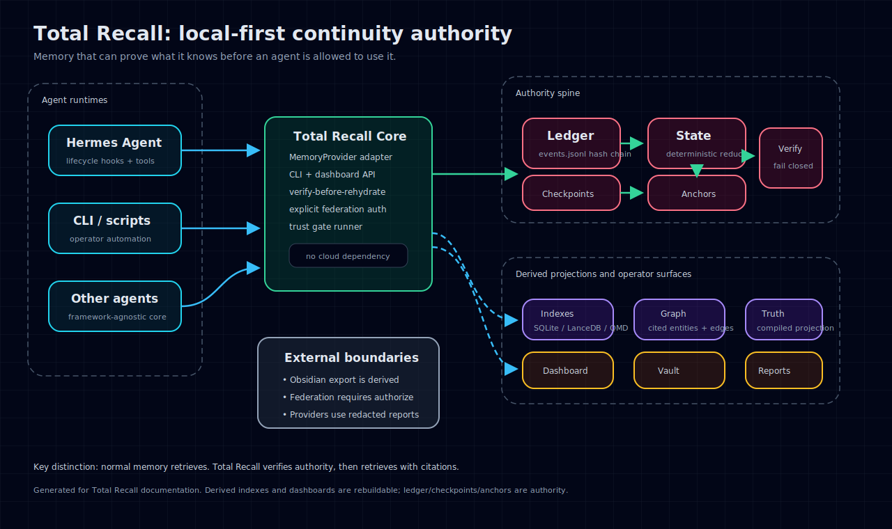

# Total Recall

Standalone, local-first continuity memory for agent runtimes.

Total Recall is a framework-agnostic continuity engine. It keeps an append-only
ledger as the source of truth, reduces that ledger into deterministic state,
creates signed checkpoints, verifies integrity before rehydration, and builds
rebuildable local retrieval indexes for recall.

It does not depend on OpenClaw, OpenBrain, or Hermes. Hermes Agent can use it
through the optional provider plugin in `hermes-plugin/total-recall`.



## Why You Need It

Most agent memory systems optimize recall: find a relevant note, vector hit, or
conversation snippet. That is useful, but it is not enough when memory affects
real work.

Total Recall is for the harder question:

> Can this agent prove the memory it is about to use is still authoritative?

It gives you a local trust spine for agent continuity:

- append-only event ledger with hash chaining
- deterministic state reduction
- signed checkpoints and anchors
- fail-closed verification and rehydrate
- cited recall and Knowledge Engine answers
- freshness checks for stale/superseded promises and decisions
- temporal graph timelines for "what did we know then?"
- explicit federation instead of silent cross-workspace memory soup
- dashboard/operator console for trust, incidents, knowledge, vault, and backups

Start here:

- [Operational manual](docs/operational-manual.md) - what to run, what good looks like, and how to operate it
- [Demo guide](docs/demo-guide.md) - dashboard/video/storyboard script and public demo flow
- [Benchmarks](docs/benchmarks.md) - reproducible continuity benchmark and scorecard
- [Nightly learning review](docs/nightly-learning.md) - candidate cards, layer routing, action boundaries, and wake-up diff
- [Memory layer comparison](docs/total-recall-memory-layer-comparison-2026-06-03.md) - how Total Recall differs from GBrain, Zep/Graphiti, Hindsight, Mem0, Letta, and native Hermes memory
- [Dashboard docs](docs/backup-dashboard.md) - Trust Spine, Knowledge Engine, Workbench, Vault, and backups

## Quick Install For Hermes

From a published package or installed checkout:

```bash
pip install total-recall-core
total-recall hermes install --profile <profile> --activate --format text
hermes -p <profile> memory status
```

The installer detects the Python environment Hermes actually runs under,
installs or upgrades `total-recall-core` there when needed, writes
`~/.hermes/plugins/total-recall`, validates the bundle, enables the Hermes
plugin, selects `memory.provider=total-recall` for the profile, and checks
Hermes memory status.

Check readiness at any time:

```bash
total-recall hermes doctor
```

From this repository checkout, the one-command installer installs the Python
package and writes a clean Hermes memory-provider bundle:

```bash
./scripts/install_hermes_plugin.sh --profile <profile> --activate --format text
```

To create a distributable plugin archive:

```bash
total-recall hermes bundle --out dist/total-recall-hermes-plugin.tar.gz
```

## What It Provides

- append-only ledger ingestion with hash chaining
- deterministic state reduction
- checkpoint creation
- signed anchor verification
- fail-closed verify and rehydrate
- hard-coded trust gate for release/day-one execution verification
- incident artifacts
- external-memory quarantine, promote, and reject flow
- file/folder document ingest for basic local context without a separate brain layer
- working-context source ingest for meetings, email, Slack, GitHub, CRM, tickets, calendars, and agent transcripts
- Obsidian/vault export plus explicit edited-note preview/promote import
- nightly learning review that emits candidate cards, layer-routing decisions, action boundaries, and a wake-up diff without mutating the ledger
- freshness reporting for current/stale/superseded promises, decisions, customers, policies, project state, and tasks
- temporal graph timeline views for "what did we know then?" versus "what changed later?"
- named multi-agent/workspace federation with explicit authorization and workspace-separated results
- derived LanceDB, QMD, and SQLite/FTS retrieval indexes with lexical fallback
- source-cited context planning
- product-facing Hermes plugin installer and distributable plugin bundle
- optional Hermes Agent memory provider plugin

## Company Context

Import local files into the ledger:

```bash
total-recall documents ingest ./docs ./handoff.md
```

Ingest a working-context source with an effective timestamp:

```bash
total-recall sources ingest \
  --type meeting \
  --title "Renewal Review" \
  --occurred-at 2026-01-05T12:00:00Z \
  --text "Decision: Renewal policy is month-to-month."
```

Export an Obsidian-compatible reading vault:

```bash
total-recall vault export --out ~/TotalRecallVault
```

The vault is a derived projection. Total Recall's ledger, checkpoints, and
anchors remain authoritative. Edited vault notes become memory only after an
explicit preview and owner promotion:

```bash
total-recall vault import-preview --vault ~/TotalRecallVault --note "Edited Promise.md"
total-recall vault import-promote <preview-id>
```

Check freshness and temporal context:

```bash
total-recall knowledge freshness --category promise --entity "brand promise"
total-recall knowledge graph timeline --entity "brand promise" --at-time 2026-01-20T00:00:00Z
```

Preview overnight learning candidates without mutating authoritative memory:

```bash
total-recall learning review --session-id nightly-learning --format text
```

This emits candidate cards, promotion decisions, and a wake-up diff. Promote chosen items through ledgered workflows only after review.

See [document ingest](docs/document-ingest.md),
[Obsidian vault export](docs/obsidian-vault-export.md), and
[nightly learning review](docs/nightly-learning.md).

## Install For Local Development

```bash
git clone git@github.com:dax8it/total-recall.git
cd total-recall
python3 -m venv .venv
. .venv/bin/activate
pip install -e '.[semantic]'
python -m pytest -q
```

The `semantic` extra installs LanceDB. It is optional; SQLite/FTS and lexical
fallback work without it.

You can also run directly from the checkout:

```bash
PYTHONPATH=src python -m total_recall_core.cli health
./bin/total-recall health
```

## Storage

Set `TOTAL_RECALL_HOME` to choose the local store. If unset, the core uses a
profile-appropriate default supplied by the caller. In Hermes, the provider uses:

```text
$HERMES_HOME/total-recall
```

Directory layout:

```text
ledger/events.jsonl
state/current.json
checkpoints/*.json
anchors/*.json
reports/*.json
reports/*.md
incidents/*.json
external-memory/{inbox,quarantine,promoted,rejected}/
reviews/learning/
reviews/obsidian/
federation/targets.json
knowledge/{index,graph,synthesis,compiled,quarantine,reports,eval,providers}/
index/total_recall.sqlite
index/lancedb/
index/lancedb-meta.json
index/qmd-docs/
index/qmd-meta.json
keys/anchor.key
keys/anchor.ed25519
keys/anchor.ed25519.pub
```

All files under `index/` are derived retrieval caches. They are rebuilt from
`ledger/events.jsonl`; they are never the authority for continuity, checkpoint,
or rehydrate decisions.

Files under `reports/` are generated audit artifacts. They remain readable for
explicit status, export, backup, and manual inspection workflows, but they are
excluded from retrieval so rehydrate output cannot recursively become future
memory input.

Search uses this ladder:

```text
LanceDB vector-ish local index
QMD compatibility index
SQLite/FTS deterministic index
lexical authority-artifact scan
```

QMD is optional and is discovered from `TOTAL_RECALL_QMD_BIN` or `PATH`.

Useful environment flags:

```bash
TOTAL_RECALL_ENABLE_LANCEDB=0
TOTAL_RECALL_ENABLE_QMD=0
TOTAL_RECALL_QMD_EMBED=1
```

## CLI

```bash
total-recall health
total-recall ingest --kind note --text "Remember this." --session-id main
total-recall documents ingest ./docs ./handoff.md
total-recall sources ingest --type meeting --title "Renewal Review" --text "Decision: Renewal policy is month-to-month."
total-recall search "Remember"
total-recall index status
total-recall index rebuild
total-recall index rebuild --backend lancedb
total-recall index rebuild --backend qmd
total-recall checkpoint --session-id main
total-recall verify --session-id main
total-recall trust verify
total-recall learning review --session-id nightly-learning --format text
total-recall rehydrate --session-id main --query "Remember"
total-recall doctor
total-recall export --out total-recall-backup.tar.gz
total-recall import total-recall-backup.tar.gz
total-recall backup run --out-dir ~/total-recall-backups --keep 14 --keep-days 90
total-recall backup status --out-dir ~/total-recall-backups
total-recall dashboard --backup-dir ~/total-recall-backups --keep 14 --keep-days 90
PYTHONPATH=src python scripts/benchmark_total_recall.py --events 250 --queries 25
total-recall incidents list
total-recall external ingest --source handoff.md --text "Imported context"
total-recall knowledge query --query "What do we know?" --mode normal --format json
total-recall knowledge freshness --category promise --format text
total-recall knowledge graph inspect --entity "project"
total-recall knowledge graph traverse --entity "project" --depth 2
total-recall knowledge graph timeline --entity "project" --at-time 2026-01-20T00:00:00Z
total-recall knowledge truth show --format md
total-recall knowledge synthesize run
total-recall knowledge evaluate run
total-recall vault import-preview --vault ~/TotalRecallVault --note "Edited Promise.md"
total-recall vault import-promote <preview-id>
total-recall federation register agent-beta /path/to/agent/total-recall --scope public
total-recall federation query --query "support promise" --target agent-beta --authorize
```

## Trust Model

The ledger is append-only JSONL with a hash chain. Checkpoints pin the reduced
state hash, event count, and last event hash. Anchors sign checkpoint hashes with
a local Ed25519 keypair stored at `keys/anchor.ed25519` and
`keys/anchor.ed25519.pub`. Legacy HMAC-SHA256 anchors remain verifiable for
older local stores, but new checkpoints use Ed25519.

Verification fails closed when:

- a ledger event hash is invalid
- the ledger hash chain is broken
- checkpoint hash mismatches
- reduced state differs from checkpoint
- anchor is missing
- anchor checkpoint hash mismatches
- anchor signature mismatches

During verification, Total Recall rebuilds derived indexes from the ledger after
the authoritative checks. A tampered or stale derived index is overwritten from
trusted ledger state rather than trusted directly.

## Hermes Setup

See [docs/hermes.md](docs/hermes.md) for one-command plugin install, profile
selection, smoke-test, recovery, and troubleshooting commands.

For local backup management, see [docs/backup-dashboard.md](docs/backup-dashboard.md).

For adding files and folders as basic document context, see
[docs/document-ingest.md](docs/document-ingest.md).

Each Hermes profile gets its own store and derived indexes at
`$HERMES_HOME/total-recall`. Multiple agents can share the same core/plugin code
while keeping profile-local ledgers and indexes isolated.

## Hermes Compaction And Rehydration

Hermes Agent owns context compaction thresholds. Total Recall does not decide
when compaction happens.

When Hermes approaches the threshold, it calls the active memory provider's
`on_pre_compress(messages)` hook before summarizing and discarding older context.
The Total Recall Hermes provider responds by:

1. ingesting a `pre_compress` event into the authoritative ledger
2. building a source-cited context plan from the local store
3. returning that block to Hermes so the compressor can preserve durable
   decisions, blockers, file paths, approvals, and next actions
4. recording the Hermes compression-driven `session_switch` after Hermes rotates
   the session id

Regular completed turns are ingested through `sync_turn()`. Session exits create
a `session_end` event and a checkpoint. Rehydration is explicit and fail-closed:

```bash
total-recall verify --session-id main
total-recall trust verify
total-recall rehydrate --session-id main --query "active continuity"
```

`rehydrate` first runs verification. If the ledger, reduced state, checkpoint, or
anchor fails validation, Total Recall refuses to produce a context block.
`trust verify` is stricter: it requires the latest checkpoint to pin the current
ledger, proves export/import persistence, runs isolated source/freshness/timeline
vault/learning-review/federation fixtures, and verifies the Hermes plugin bundle surface.

## Nightly Learning Review

Total Recall can preview what today's events should change tomorrow without letting an unattended job silently rewrite durable truth:

```bash
total-recall learning review --session-id nightly-learning --format text
```

The review emits candidate cards, layer routing (`gbrain_page`, `runtime_startup_rule`, `open_loop`, `archive`), action boundaries, promotion decisions, and a compact wake-up diff. Persisted reviews live under `reviews/learning/`; they are generated review artifacts, not authoritative memory. Promote chosen items through ledgered ingest/source/vault workflows, put precise reminders in a scheduler, and checkpoint after real promotions.

See [docs/nightly-learning.md](docs/nightly-learning.md).

## Automatic Rehydration

The Hermes provider can automatically inject a verified rehydrate block when
continuity risk rises. This is provider policy layered on top of Hermes
compaction; Hermes still owns compaction thresholds.

Default policy:

```yaml
memory:
  total-recall:
    auto_rehydrate:
      enabled: true
      context_threshold: 0.70
      cooldown_seconds: 180
      startup_cooldown_seconds: 900
      compression_count_threshold: 2
      stale_check_every_turns: 5
      max_chars: 5000
```

Automatic triggers:

- Hermes startup or gateway restart
- `/new`
- `/resume`
- branch/session id changes
- after compaction
- after repeated compactions in one session
- context usage crossing 70 percent
- stale checkpoint detection
- low local continuity confidence during prefetch

The provider stores cooldown state at:

```text
$HERMES_HOME/total-recall/state/auto_rehydrate.json
```

Automatic rehydrate still fails closed. If verification fails, the injected block
is a short warning that asks the agent to use `total_recall_verify` before
trusting prior continuity.

## Future Add-Ons

External semantic memory adapters are deferred. They should be implemented as
derived-memory bridges, not as replacements for the local authority.

Planned candidates:

- Hindsight adapter for retain, recall, reflect, entity extraction, and synthesis
- Honcho adapter for user/agent peer modeling, cards, context, and conclusions
- Mem0 adapter for fact extraction, dedupe, profile recall, and semantic search

Trust boundary:

```text
external adapter result
-> Total Recall external-memory quarantine
-> review/promote/reject
-> promoted item becomes a ledger event
-> checkpoint/anchor verification covers the promoted truth
```

Adapters must never write directly to authoritative state. The ledger,
checkpoints, and anchors remain the source of truth; external systems can only
produce cited candidates and receipts.

## Test, Benchmark, And Release Smoke

```bash
PYTHONDONTWRITEBYTECODE=1 PYTHONPATH=src python -m pytest -q
PYTHONDONTWRITEBYTECODE=1 python scripts/privacy_scan.py
PYTHONDONTWRITEBYTECODE=1 ./scripts/install_smoke.sh
PYTHONDONTWRITEBYTECODE=1 PYTHONPATH=src python scripts/benchmark_total_recall.py --events 250 --queries 25
```

For the full public-facing validation checklist, see [docs/release-checklist.md](docs/release-checklist.md). For benchmark interpretation, see [docs/benchmarks.md](docs/benchmarks.md).
