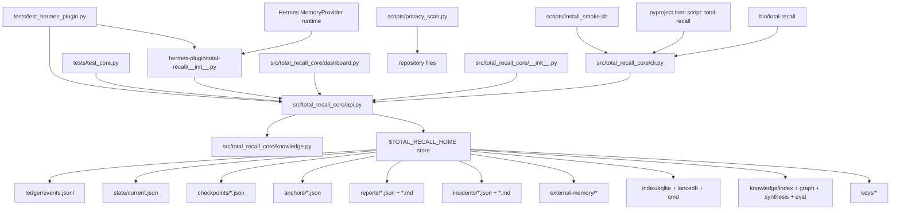
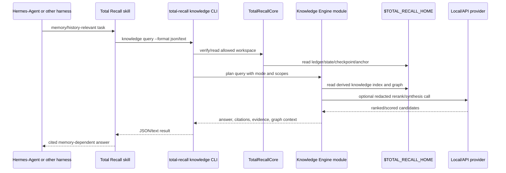

# Total Recall Knowledge Engine Architecture

- Owner: Alex Covo / Total Recall maintainer
- Last updated: 2026-05-18
- Stale by: 2026-06-18
- Status: current-state plus target architecture
- Related docs: [roadmap](knowledge-engine-roadmap.md), [decisions](knowledge-engine-decisions.md), [risks](knowledge-engine-risks.md), [API](knowledge-engine-api.md), [tribal knowledge](knowledge-engine-tribal-knowledge.md), [runbook](knowledge-engine-runbook.md)

This document maps the current code after the local-first Knowledge Engine and admin control-center work. The dependency graph is based on the actual imports in `src/`, `hermes-plugin/`, `scripts/`, and `tests/`.

## Current Entry Points

| Entry point | File | Current responsibility | Drift against Knowledge Engine goal |
|---|---|---|---|
| Python package export | `src/total_recall_core/__init__.py` | Exposes `TotalRecallConfig` and `TotalRecallCore`; Knowledge Engine is reached through `TotalRecallCore.knowledge_*` methods. | Direct `KnowledgeEngine` export remains intentionally private for now. |
| CLI | `src/total_recall_core/cli.py` | Parses `total-recall` commands, including source ingest, vault export/import review, `knowledge query`, freshness, graph inspect/traverse/timeline, truth status/build/show, named federation, and external-provider authorization flags. | Quarantine listing and richer report browsing are still future work. |
| Core API | `src/total_recall_core/api.py` | Owns ledger, state reduction, checkpoints, anchors, verification, retrieval indexes, external-memory queues, reports, backup/import/export, doctor, and Knowledge Engine delegation. | Core remains the authority boundary; more KE internals may move out as the module deepens. |
| Dashboard | `src/total_recall_core/dashboard.py` | Local HTTP remote-MCP/admin-style control center for trust spine status, Knowledge Engine operations, query/graph/freshness/source/truth workbench, Obsidian export/import review, remote provider readiness, backups, doctor, verify, and launchd plist generation. | OAuth-protected remote serving, SSE activity, and scoped remote clients are still future work. |
| Hermes memory provider | `hermes-plugin/total-recall/__init__.py` | Implements Hermes memory hooks and tools over `TotalRecallCore`, including source ingest, KE query/freshness/status/synthesis-status, compiled-truth, graph inspect/timeline, and explicit federation query tools. | No Hermes tool for owner-only promotion yet. |
| Smoke script | `scripts/install_smoke.sh` | Fresh package install and core lifecycle smoke. | Does not cover Knowledge Engine. |
| Privacy scan | `scripts/privacy_scan.py` | Blocks local paths and sensitive strings before sharing. | Provider reports now avoid raw memory text; privacy scan can still add explicit KE report path coverage. |
| Unit tests | `tests/test_core.py` | Covers ingest, search, checkpoint, verify, tamper, external-memory, document/source ingest, vault export/import review, backup, index, KE query/graph/freshness/timeline/synthesis/evaluation behavior, provider reports, named federation semantics, and external-provider authorization/degradation. | Real provider integration fixtures remain future work. |
| Hermes tests | `tests/test_hermes_plugin.py` | Covers provider lifecycle, tools, pre-compress, auto-rehydrate, fail-closed tamper, KE query, compiled-truth, and graph-inspect tool exposure. | No Hermes owner-only promotion tool coverage yet. |

## Current Dependency Graph



## Current Store Layout

Current code creates these directories directly under `$TOTAL_RECALL_HOME`:

```text
ledger/
state/
checkpoints/
anchors/
reports/
incidents/
external-memory/{inbox,quarantine,promoted,rejected}/
index/
keys/
knowledge/{index,graph,synthesis,quarantine,reports,eval,providers}/
```

Knowledge Engine planning uses:

```text
knowledge/
  index/
  graph/
  synthesis/
  quarantine/
  reports/
  eval/
  providers/
```

The `knowledge/` tree is derived and disposable. Promotions/owner approvals remain canonical ledger events. See [D-004](knowledge-engine-decisions.md#d-004-knowledge-engine-derived-artifacts-use-the-total-recall-home-knowledge-namespace) and [D-002](knowledge-engine-decisions.md#d-002-the-deterministic-ledger-remains-the-authority).

## Current Module Responsibilities

| Module | Responsibilities | Production-critical ownership |
|---|---|---|
| CLI | Stable user/agent command surface; argument parsing; JSON output. | Total Recall maintainer. |
| Core API | Authoritative state, ledger verification, index rebuild, import/export, reports. | Total Recall maintainer; fail closed on integrity errors. |
| Dashboard | Local admin control center for backup, verification, Knowledge Engine operations, remote provider readiness, and operator recall workbench. | Total Recall maintainer; local-only by default until OAuth/scoped remote MCP serving exists. |
| Hermes provider | Hermes lifecycle hooks, memory tools, auto-rehydrate policy. | Total Recall maintainer; Hermes runtime owns compaction thresholds. |
| Scripts | Privacy scan and install smoke. | Total Recall maintainer; must stay fast and local. |
| Tests | Regression coverage for authority, plugin lifecycle, tamper, export/import, retrieval. | Total Recall maintainer. |

## Target Knowledge Engine Responsibilities

The build should introduce these responsibilities behind the existing core/CLI seam:

| Responsibility | Behavior | Governing decisions |
|---|---|---|
| Source reader | Reads ledger, state, rollups when present, and derived synthesis; treats transcripts/handoffs as fallback citations only. | [D-003](knowledge-engine-decisions.md#d-003-source-policy-is-spine-first), [D-017](knowledge-engine-decisions.md#d-017-backward-compatibility-is-mandatory) |
| Sanitizer | Redacts secrets and tags/quarantines prompt-injection-like content before indexing/provider calls. | [D-019](knowledge-engine-decisions.md#d-019-abuse-defenses-run-at-indexing-query-and-synthesis-time) |
| KE store | Maintains SQLite/FTS5 tables for candidates, entities, edges, citations, synthesis metadata, eval receipts, and provider reports. | [D-004](knowledge-engine-decisions.md#d-004-knowledge-engine-derived-artifacts-use-the-total-recall-home-knowledge-namespace), [D-005](knowledge-engine-decisions.md#d-005-sqlite-fts5-is-the-local-first-knowledge-engine-store) |
| Graph extractor | Creates evidence-locked entities/edges; quarantines weak proposals. | [D-009](knowledge-engine-decisions.md#d-009-entity-graph-is-evidence-locked), [D-010](knowledge-engine-decisions.md#d-010-v1-graph-ontology-is-deliberately-small) |
| Query planner | Uses FTS, graph expansion, optional embeddings, reranking, confidence modes, stale/conflict handling, and citations. | [D-006](knowledge-engine-decisions.md#d-006-embeddings-are-optional-and-advisory), [D-007](knowledge-engine-decisions.md#d-007-reranking-is-pluggable-provider-agnostic-and-local-first), [D-014](knowledge-engine-decisions.md#d-014-conflict-and-stale-fact-handling-is-intent-aware), [D-015](knowledge-engine-decisions.md#d-015-confidence-modes-gate-answer-behavior) |
| Synthesis runner | Produces provisional nightly artifacts through staging and atomic publish. | [D-011](knowledge-engine-decisions.md#d-011-nightly-synthesis-is-derived-and-provisional) |
| Workspace federation | Keeps indexes per workspace; merges only through explicit authorized federation. | [D-016](knowledge-engine-decisions.md#d-016-multi-workspace-support-is-read-first-with-explicit-federation) |
| Evaluation harness | Produces before/after scorecards and release gates. | [D-020](knowledge-engine-decisions.md#d-020-evaluation-gates-stable-release) |

## Target Flow



## Drift Flags

| Intended behavior | Actual behavior today | Required action |
|---|---|---|
| `total-recall knowledge ...` CLI namespace | Namespace exists for status/query/index/freshness/graph inspect/traverse/timeline/truth/synthesize/evaluate, plus explicit query-time federation flags and named federation registry. | Add quarantine listing and richer report browsing. |
| `--format json|md|text` | KE query supports JSON/Markdown/text; other commands still use JSON. | Extend formatting only where operator workflows need it. |
| `$TOTAL_RECALL_HOME/knowledge/` derived namespace | Layout exists and stays separate from legacy `index/`. | Decide export/import treatment for derived KE artifacts. |
| V1 scopes include `public` | Config now includes `public` while preserving `shared_team`. | Add migration/alias notes when scope model stabilizes. |
| Evidence-locked graph | Deterministic graph extraction writes active entities/edges with source refs/evidence hashes, and graph inspect/traverse returns cited source evidence. | Add richer ontology and model-assisted quarantine. |
| Compiled truth projection | `knowledge truth build/show` writes a ledger-derived markdown/JSON projection for decisions, promises, tasks, entities, and timeline. Obsidian export/import review keeps edited markdown behind preview/promote. | Add page-version diffs and richer review diffs. |
| Nightly synthesis | Initial derived synthesis run/status/promote exists with owner-promotion ledger append. | Add scheduler examples, failed-run preservation tests, and richer summaries. |
| No raw transcript bulk indexing | Current index only indexes ledger events; this matches intent. | Preserve this behavior; only allow redacted citation snippets. |
| Scorecard release gate | KE evaluate run/scorecard now includes current-store checks plus synthetic fixtures for compiled truth, graph traversal, scope leaks, contradictions, temporal recall, report fencing, provider reports, external-provider gating, redacted Hermes-style recall, and federation. | Add larger redacted-Hermes fixture corpus and release packaging gates. |

## Load-Bearing Seams

- CLI to core API: all agent-facing commands must pass through stable core methods rather than reimplementing store access.
- Core API to store: authoritative reads must verify ledger/checkpoint/anchor before trusted rehydrate or strict KE answers.
- KE derived store to ledger: every derived row must cite a source event/state/synthesis artifact and source hash.
- Provider boundary: provider payloads must be redacted/scope-filtered and logged.
- Hermes provider to core: Hermes tools should expose KE query/status without bypassing fail-closed verification.
- Skills repo to CLI: skills should call `total-recall knowledge ...`, not import Python internals.
